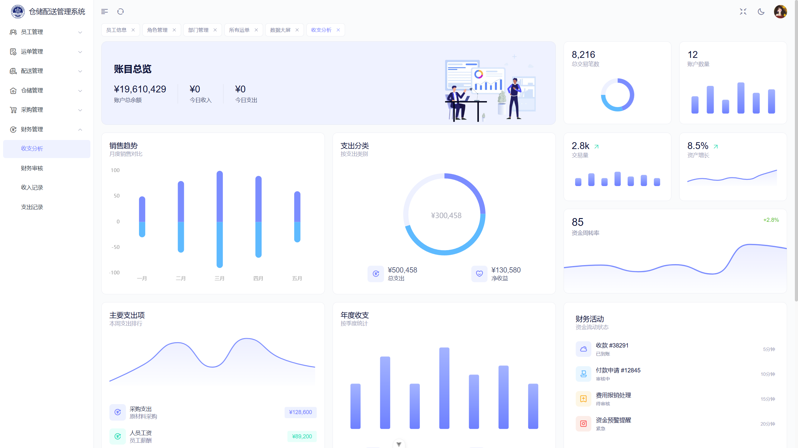

# 仓储配送管理系统

## 项目介绍

这是一个企业场景的仓储配送管理系统，但需要注意，这只是一个普通的本科课程设计作业，大部分功能远远达不到成熟的企业系统的需求，因此仅适合用于学习，并不适合用来构建生产级系统。

## 技术选型

- 重要声明：本项目是基于[Art-Design-Pro](https://github.com/Daymychen/art-design-pro)开源项目修改开发的，非常感谢原作者。
- 前端：Vue3 + Vite + ElementPlus
- 后端：Django + MySQL

## 功能模块

- 员工管理模块：包括员工信息管理，职务管理、部门管理、个人信息管理等功能
- 运单管理模块：包括运单信息管理、运单创建、运单查询、运单审核与确认等功能
- 配送管理模块：包括配送大屏、配送线路管理、车辆管理、配送订单管理等功能
- 仓储管理模块：包括商品管理、仓库库存管理、查看出入库记录等功能
- 采购管理模块：包括创建采购订单、供应商管理等功能
- 财务管理模块：包括财务大屏，财务审核、查看收支记录等功能

## 项目运行

1. 安装 Git、Python、MySQL、Nodejs、pnpm
2. 克隆项目到本地
3. 修改后端的.env 文件，配置数据库连接地址
   注意：不需要创建数据表，Django 支持自动建表
4. 前端运行

   ```
   pnpm install
   pnpm dev
   ```

5. 后端运行
   - 安装依赖：

   ```
   pip install -r requirements.txt
   ```

   - 使用 Django 创建数据表

   ```
   python manage.py makemigrations Core
   python manage.py migrate
   ```

   - 启动后端

   ```
   python manage.py runserver
   ```

## 图片展示




